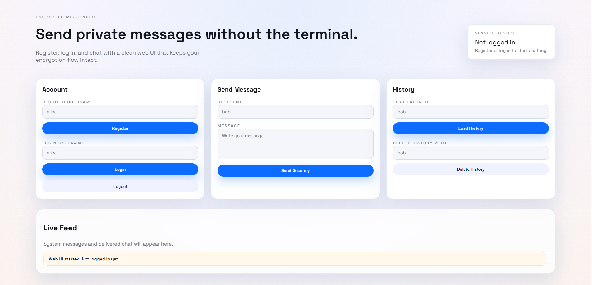

## Encrypted Chat Room

This project is a small end-to-end encrypted messenger with both a CLI client and a Flask-based web UI. Users can register, log in, send messages, and view or delete local chat history. The server relays messages and manages account public keys, while encryption happens on the client.

### Encryption Overview

- Each user creates an RSA key pair on registration; the public key is stored on the server and the private key stays local.
- When sending a message, the clients perform a signed Diffie-Hellman key exchange to derive a shared secret.
- That shared key is expanded with HKDF and used for AES-CBC encryption; an HMAC-SHA256 signature protects message integrity.
- Message history is stored locally encrypted with the user's RSA public key.

## Installation

First run the command `docker-compose build` to build the docker images

Then, run the command `docker-compose up` to start up the server and two client images

## Usage

Use `docker ps --format "{{.ID}} {{.Names}}"` command to show the ID and name for the online containers.

Then use `docker exec -it <id> /bin/bash` or `docker exec -it <id> /bin/sh` to enter the container.

The server side will automatically run after the docker container is online.

Use `python3 client.py` to run the program on the client side.

### Web UI (Flask)

1. Enter one of the client containers: `docker exec -it <id> /bin/bash`
1. Start the web app: `python3 web_app.py`
1. Visit `http://localhost:8080` on your host to use the UI.

Notes:
- The UI writes private key files to the client container when you register, just like the CLI.
- Use two client containers for multi-user testing, one with the web UI and one with the CLI or a second web UI.
- Each browser session gets its own isolated client state (cookies), so multiple people can use the UI concurrently.
- For a custom session secret, set `WEB_UI_SECRET` before starting `web_app.py`.

### Client Commands (for use in CLI)

After run the client program, you can use `help` or `h` will show the help menu.

`register` or `r` will register a new account.

`login` or `l` will log in as the existing account.

`message` or `m` can send the message to another user.

`view` or `v` can have a look at the message history stored locally.

`delete` or `d` can delete the message history with another user.

`logout` or `u` can log out the current account.

`quit` or `q` can exit the program safely.
